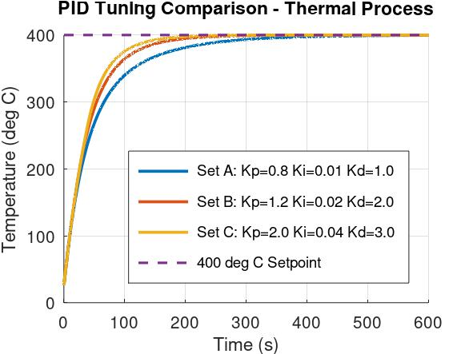

# Smart Pyrolysis Thermal PID Control System

Simulation and analysis of an ESP32-based PID temperature control system for a first-order pyrolysis thermal process using **GNU Octave** and **Wokwi**.

## Project Overview

This project develops and evaluates a simulated closed-loop PID temperature control system for a pyrolysis thermal process.

The project combines:

- First-order thermal process modelling
- PID temperature control
- PWM-based heater power control
- Conditional-integration anti-windup
- PID gain comparison
- Setpoint tracking validation
- GNU Octave analysis
- ESP32 implementation in Wokwi

> **Note:** This project is currently simulation-based. The thermal model parameters are assumed for control-system development and have not been identified from a physical pyrolysis reactor.

---

## System Architecture

The simulated closed-loop system follows this control structure:

```text
Temperature Setpoint
        |
        v
  PID Controller
        |
        v
 PWM Heater Power
        |
        v
  Thermal Process
        |
        v
Process Temperature
        |
        +-------- Feedback --------> PID Controller
```

The controller continuously calculates the difference between the required temperature and the simulated process temperature and adjusts heater power accordingly.

---

## Thermal Process Model

The thermal process is represented using a first-order model:

```text
τ(dT/dt) + T = Tambient + K·u
```

where:

- `T` = process temperature
- `Tambient` = ambient temperature
- `u` = normalized heater input from 0 to 1
- `K` = process gain
- `τ` = thermal time constant

The simulation parameters are:

```text
Ambient Temperature = 25 °C
Process Gain K       = 500
Time Constant τ      = 60 s
```

The corresponding first-order transfer function is:

```text
             500
G(s) = ----------------
           60s + 1
```

GNU Octave was used to examine the response of this model and evaluate the closed-loop controller.

---

## PID Controller

The controller follows the standard PID control law:

```text
u(t) = Kp·e(t) + Ki∫e(t)dt + Kd·de(t)/dt
```

where:

- `Kp` = proportional gain
- `Ki` = integral gain
- `Kd` = derivative gain
- `e(t)` = difference between setpoint and process temperature

The controller output is limited to the ESP32 PWM range:

```text
PWM = 0 to 255
```

This corresponds to:

```text
Heater Power = 0% to 100%
```

---

## Anti-Windup Implementation

During controller development, output saturation was considered because the simulated heater cannot provide less than 0% or more than 100% power.

A **conditional-integration anti-windup method** was implemented.

The integral term is updated only when the controller is operating within the output limits or when the control error would move the controller away from saturation.

This prevents excessive integral accumulation and improves the simulated transient response.

---

## PID Tuning Comparison

Three PID gain configurations were evaluated using the same thermal process model.

| PID Set | Kp | Ki | Kd | Rise Time | Settling Time | Overshoot | Steady-State Error |
|---|---:|---:|---:|---:|---:|---:|---:|
| Set A | 0.8 | 0.01 | 1.0 | 132.50 s | 281.90 s | 0.00% | 0.32 °C |
| Set B | 1.2 | 0.02 | 2.0 | 93.10 s | 176.30 s | 0.00% | 0.00 °C |
| **Set C** | **2.0** | **0.04** | **3.0** | **78.70 s** | **146.00 s** | **0.00%** | **0.00 °C** |

Among the evaluated configurations, **Set C** produced the shortest rise and settling times while maintaining zero simulated overshoot and approximately zero steady-state error.

### Selected PID Gains

```text
Kp = 2.0
Ki = 0.04
Kd = 3.0
```

These values represent the selected gains among the configurations evaluated in this simulation and are not claimed to be globally optimal PID parameters.

---

## Performance Evaluation

Controller performance was evaluated using:

- Rise time
- Settling time
- Maximum temperature
- Percentage overshoot
- Steady-state error
- Heater power requirement

For the selected PID configuration and a **400 °C setpoint**, the simulation produced:

```text
Rise Time          = 78.70 s
Settling Time      = 146.00 s
Overshoot          = 0.00%
Steady-State Error ≈ 0.00 °C
```

---

## Setpoint Tracking Validation

The controller was also evaluated under changing temperature references.

The test profile was:

```text
0 - 250 s     → 400 °C
250 - 500 s   → 350 °C
500 - 750 s   → 450 °C
```

The simulated controller successfully tracked each setpoint change and returned toward the required steady-state temperature without sustained oscillation.

This test was used to compare the response of PID Set B and PID Set C under changing operating references.

---

## ESP32 / Wokwi Implementation

The selected controller was implemented using an **ESP32 simulation in Wokwi**.

The implementation includes:

- PID calculation
- PWM-based heater control
- First-order thermal process simulation
- PWM output saturation
- Conditional-integration anti-windup
- Real-time serial monitoring

The serial output reports:

```text
Setpoint
Process Temperature
PWM Output
Heater Power (%)
```

At the 400 °C steady-state operating point, the Wokwi simulation produced approximately:

```text
Setpoint       = 400.00 °C
Temperature    = 400.00 °C
PWM Output     = 191.25
Heater Power   = 75.00%
```

---

## Steady-State Heater Power

For the simulated thermal model:

```text
Tambient = 25 °C
K        = 500
Ttarget  = 400 °C
```

The required normalized steady-state heater input is:

```text
u = (Ttarget - Tambient) / K

u = (400 - 25) / 500

u = 0.75
```

Therefore:

```text
Heater Power = 75%
```

The corresponding ESP32 PWM value is:

```text
PWM = 0.75 × 255

PWM = 191.25
```

This agrees with the final Wokwi simulation result.

---

## GNU Octave Analysis

GNU Octave was used for:

- First-order process modelling
- Thermal response simulation
- PID controller simulation
- Anti-windup implementation
- PID gain comparison
- Performance metric calculation
- Setpoint tracking analysis

The Octave scripts are available in the:

```text
octave/
```

directory.

---

## Wokwi Simulation Files

The ESP32 simulation files are stored in:

```text
wokwi/
```

This directory contains:

```text
sketch.ino
diagram.json
```

`sketch.ino` contains the ESP32 PID controller and simulated thermal process.

`diagram.json` contains the Wokwi circuit configuration.

---

## Simulation Results

### PID Temperature Response

The selected PID controller regulates the simulated thermal process toward the 400 °C setpoint.


### Heater Power Response

The heater initially operates at high power to increase the process temperature and then reduces its output as the temperature approaches the setpoint.


### PID Tuning Comparison

Three PID parameter sets were evaluated to compare their transient and steady-state performance. Set C (`Kp = 2.0`, `Ki = 0.04`, `Kd = 3.0`) provided the fastest response among the tested configurations while maintaining zero simulated overshoot.



### Setpoint Tracking Test

The controller was also evaluated under changing temperature references of 400 °C, 350 °C, and 450 °C to examine its ability to follow different operating setpoints.


## Tools and Technologies

- ESP32
- Wokwi
- GNU Octave
- Embedded C/C++
- PID Control
- PWM Control
- Control-System Modelling
- First-Order Transfer Functions
- Serial Monitoring

---

## Repository Structure

```text
Smart-Pyrolysis-PID-Control/
│
├── README.md
│
├── wokwi/
│   ├── sketch.ino
│   └── diagram.json
│
├── octave/
│   ├── pyrolysis_pid_simulation.m
│   ├── pid_comparison.m
│   └── pid_setpoint_test.m
│
└── results/
    └── simulation result images
```

---

## Project Limitations

This project currently represents a **simulation-based control-system study**.

The process gain and thermal time constant used in the model are assumed simulation parameters and were not obtained through experimental system identification of a physical pyrolysis reactor.

Therefore:

- The selected PID gains have only been validated within the simulated model.
- A physical heating element was not controlled in this stage of the project.
- Real thermocouple measurements were not used for the current simulation.
- Real pyrolysis systems may have nonlinear behaviour, delays, disturbances, and operating constraints that are not represented by this simplified first-order model.
- The current PID gains should not be transferred directly to a real high-temperature system without system identification, retuning, appropriate hardware, and safety protection.

---

## Future Development

Future development may include:

- Experimental identification of thermal process parameters
- Thermocouple-based temperature measurement
- Physical low-voltage thermal control prototype
- Heater-driver circuit implementation
- Hardware PID validation
- Over-temperature protection
- Sensor-fault detection
- Real-time monitoring interface
- Data logging
- Comparison of simulated and experimental temperature responses

---

## Project Status

**Current stage:** Simulation, PID tuning, and ESP32/Wokwi validation completed.

**Next stage:** Hardware-oriented development and experimental thermal-process validation.
